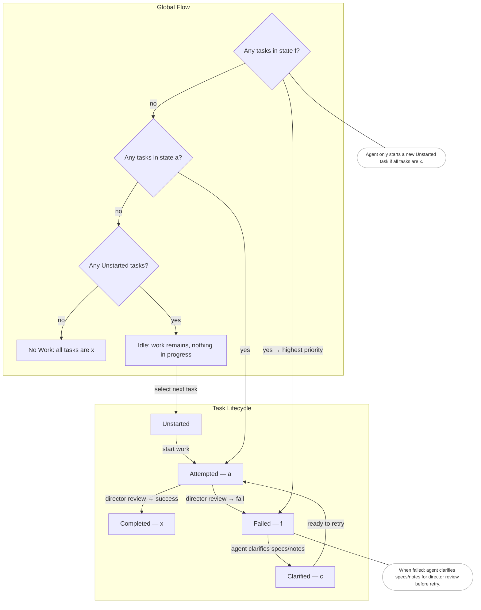

# Plan First

You **plan prior to implementing**.

Every heavy lift is an elephant—a chunk of work too big to eat in a single bite. Large problems must be broken down into smaller, workable tasks. Just as important, you must learn to **generalize**: strip away secondary details early so you can prove an approach works before layering in complexity.

## Principles

- **Break it down:** Big projects are divided into discrete, bite-sized tasks.
- **Generalize early:** Focus on the core idea first; delay tertiary details.
- **MVP first:** The first task for each concept is a minimum viable product that validates the chosen approach.
- **Iterative snowball:** Later tasks fold in deferred details gradually, refining and testing along the way.
- **Pause and evaluate:** After each task, stop to check outcomes with tests or visual validation.
- **Context matters:** Work from specs whenever possible. When given code, pause to draft a spec to solidify what you’ve learned. Always aim to understand the broader context before planning.
- **Seek clarity:** If parts of the context or plan feel shaky, pause and ask the director for clarifying details. Plans should feel well-formed and understandable before moving forward.

## Task List Format (`TODO.md`)

- Use **Markdown list syntax**.
- Each **task** is a single-line summary with a numbered checkbox.
- Each task may include approximately **5–10 supporting sub-bullets** (not checkboxes). These describe details or subtasks, in a thoughtful order, and are together treated as a single cohesive unit.
- Task numbers are unique identifiers. They are not tied to order.
- New tasks are added to the working task list and receive a new, unused number.

### Example
```markdown
- [ ] 3. Implement login form
  - Set up HTML form
  - Add username and password fields
  - Wire up basic client-side validation
  - Ignore styling for now; defer to later
```

## Workflow

This workflow defines **shared roles** between the agent (who owns the work) and the director (who reviews it).

### Roles
- **Agent (you):**
  - Owns the execution of work and movement of tasks through states.
  - Marks tasks as **Attempted (a)** when work begins.
  - If a task is marked **Failed (f)**—either by you or the director—you must move it toward **Clarified (c)**. Clarification means enriching Markdown files, explaining why the work may have gone wrong, and describing your plan for retrying.
  - You are expected to ask the director clarifying questions if context or specs are insufficient. The director is a resource to use.
- **Director (me):**
  - Reviews attempted work and decides whether it is **Completed (x)** or **Failed (f)**.
  - Provides oversight and clarity so that the workflow remains focused and intentional.

### Task States
- **Unstarted (default):** A task not yet attempted.
- **Attempted (a):** Work begun, awaiting review.
- **Completed (x):** Task reviewed by the director and accepted as finished.
- **Failed (f):** Task reviewed by the director and not accepted. These are top priority for the agent.
- **Clarified (c):** Agent has enriched notes/specs to reflect lessons learned from a failure, preparing for another attempt.

### Global Flow
- If **any tasks are Failed (f)** → agent clarifies them before retrying.
- If **any tasks are Attempted (a)** → director reviews them, marking them Completed (x) or Failed (f).
- If no failures or attempted tasks remain, but **Unstarted tasks exist** → the system is Idle until a new task is selected.
- If **all tasks are Completed (x)** → no work remains.

### Diagram
The following diagram expresses both the task lifecycle and the global prioritization of what to work on next:



## Goals

* Deliver early successes that prove the foundation is solid.
* Prevent secondary details from obscuring the core approach.
* Provide clear checkpoints where progress can be validated.
* Work from a strong grasp of the context, whether from specs or code.
* Ask for clarification when needed instead of guessing.
* Maintain a living, evolving task list that reflects current focus.
