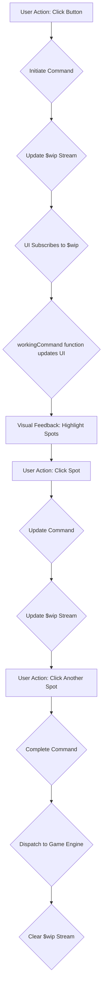

# PRD: The `workingCommand` Abstraction

This document explains the `workingCommand` abstraction, a client-side pattern used to handle multi-step commands in the Meeplitis user interface.

## 1. Introduction: What is a `workingCommand`?

A `workingCommand` is a temporary, client-side state that represents a command a user is in the process of building. It's used for actions that can't be completed in a single click, such as selecting a piece to move and then selecting its destination.

The `workingCommand` provides immediate visual feedback to the user about the command they are building, guiding them through the steps required to complete it.

## 2. The Problem: Why Do We Need It?

Some game actions are too complex for a single user interaction. For example, in the game of Mexica, building a canal requires the user to first select the "construct canal" action, and then select two adjacent spots on the board.

Without a client-side mechanism to manage this intermediate state, we would have to send a command to the server after each click. This would be inefficient and would result in a sluggish user experience.

The `workingCommand` solves this problem by allowing the client to manage the state of the command being built. A command is only sent to the server once it is fully formed.

## 3. How It Works: The `workingCommand` Lifecycle

The `workingCommand` pattern is implemented using a "work-in-progress" stream, which we'll call `$wip`. This stream holds the state of the command being built.

Here is the lifecycle of a `workingCommand`, illustrated with the "construct canal" action from the Mexica game.




### Step 1: Initiating the Command

The user initiates the command by clicking on an element that represents the action they want to take.

*   **User Action:** The user clicks the "Construct Canal" button.
*   **Code:** An event handler calls `$.reset($wip, {type: "construct-canal", details: {size: 2}})` to set the initial state of the `$wip` stream.

```javascript
// From src/games/mexica/table/H7z/ui.js

$.on(el, "click", `#table.act[data-status='actions'] #supplies div.canals`, function(e){
  const type = "construct-canal",
        size = parseInt(closestAttr(this, "data-size"));
  $.reset($wip, {type, details: {size}});
});
```

### Step 2: Providing Visual Feedback

The UI subscribes to changes in the `$wip` stream. When the stream is updated, a special function called `workingCommand` is called to update the UI.

*   **Code:** The `workingCommand` function reads the state of the `$wip` stream and sets a series of `data-command-*` attributes on a container element.

```javascript
// From src/games/mexica/table/H7z/ui.js

function workingCommand([curr, prior], seat, {contents}, game, el){
  const type = curr?.type;
  const attrs = {
    "data-command-type": type,
    "data-command-spots": null,
    // ... other command attributes
  };
  switch (type) { //only multi-step commands appear here
    // ...
    case "construct-canal": {
      const {details} = curr;
      const spots = _.filter(_.partial(c.dry, c.board, contents), c.spots);
      attrs["data-command-spots"] = _.join(" ", spots);
      attrs["data-command-size"] = details.size;
      attrs["data-command-at"] = details.at;
      break;
    }
    // ...
  }
  $.eachkv(retainAttr(el, _, _), attrs);
}
```

*   **CSS:** CSS rules use these `data-command-*` attributes to provide visual feedback. For example, valid spots for the canal might be highlighted.

### Step 3: Updating the Command

The user performs the next action in the sequence, such as clicking on a valid spot on the board.

*   **User Action:** The user clicks on a valid spot for the canal.
*   **Code:** An event handler updates the `$wip` stream with the new information.

```javascript
// From src/games/mexica/table/H7z/ui.js

$.on(el, "click", `#table.act[data-status='actions'][data-command-type="construct-canal"][data-command-size="2"] div[data-spot]`, function(e){
  const type = "construct-canal",
        at   = _.chain(_.compact([closestAttr(this, "data-command-at"), closestAttr(this, "data-spot")]), _.distinct, _.toArray),
        size = parseInt(closestAttr(this, "data-command-size"));
  if(_.count(at) == 2) {
    $.dispatch($story, {type, details: {at}});
  } else {
    $.reset($wip, {type, details: {size: 2, at}});
  }
});
```

Notice that if the command is not yet complete (i.e., only one spot has been selected), the code calls `$.reset($wip, ...)` to update the `workingCommand` with the first selected spot.

### Step 4: Completing the Command

Once the user has provided all the necessary information, the command is complete.

*   **User Action:** The user clicks on the second valid spot for the canal.
*   **Code:** The event handler from the previous step now finds that `_.count(at) == 2`. It then reads the final state from the `$wip` stream and dispatches the command to the game engine using `$.dispatch($story, ...)`.

After the command is dispatched, the `$wip` stream is typically cleared, and the UI returns to its normal state.

## 4. How to Implement a New Multi-Step Command

Here is a guide for an entry-level developer on how to use the `workingCommand` pattern to implement a new multi-step command.

### 1. Define the Command State

First, decide what information you need to collect from the user. This will be the state of your `workingCommand`. It should be a simple JavaScript object with a `type` and a `details` property.

For example, a "move" command might have the following state:

```javascript
{
  type: "move",
  details: {
    from: "A1",
    to: null // This will be filled in by the user's next click
  }
}
```

### 2. Initiate the Command

Create an event handler that initiates the command. This handler should call `$.reset($wip, ...)` to set the initial state of the `$wip` stream.

```javascript
$.on(el, "click", ".piece-to-move", function(e){
  const from = closestAttr(this, "data-spot");
  $.reset($wip, {type: "move", details: {from}});
});
```

### 3. Provide Visual Feedback

In the `workingCommand` function, add a `case` for your new command type. In this case, you should set `data-command-*` attributes that your CSS can use to provide visual feedback.

```javascript
// In the workingCommand function
case "move":
  const {details} = curr;
  const moves = g.moves(game, {type, seat});
  const to = _.map(moves, move => move.details.to);
  attrs["data-command-from"] = details.from;
  attrs["data-command-to"] = _.join(" ", to);
  break;
```

Your CSS can then use these attributes to highlight the possible destination spots:

```css
[data-command-type="move"] [data-spot] {
  /* Style for non-movable spots */
}

[data-command-type="move"][data-command-to~="B2"] [data-spot="B2"] {
  /* Style for a movable spot */
  outline: 2px solid yellow;
}
```

### 4. Complete the Command

Create an event handler that completes the command. This handler should read the necessary information from the DOM, update the command object, and then dispatch it.

```javascript
$.on(el, "click", `[data-command-type="move"][data-command-from] [data-spot]`, function(e){
  const to = closestAttr(this, "data-spot");
  const from = closestAttr(this, "data-command-from");
  const game = moment($story);
  const moves = g.moves(game, {type: "move", seat});
  const move = _.detect(moves, move => move.details.from === from && move.details.to === to);

  if (move) {
    $.dispatch($story, move);
  }
});
```

By following these steps, you can implement a new multi-step command that is consistent with the existing `workingCommand` pattern, providing a smooth and intuitive user experience.

## 5. More on the `$wip` Stream

The `$wip` stream is an instance of a `stream` from the `/libs/atomic_/shell.js` library. A stream is a value that changes over time. You can subscribe to a stream to be notified when its value changes.

In the context of the `workingCommand`, the `$wip` stream holds the state of the command being built. When a user action changes the command, the `$wip` stream's value is updated, and the UI is re-rendered to reflect the change.

### `$.reset($wip, ...)` vs `$.swap($wip, ...)`

*   `$.reset($wip, ...)` is used to completely replace the value of the `$wip` stream. This is useful for initiating a new command or for updating the command with a completely new state.

*   `$.swap($wip, ...)` is used to update the value of the `$wip` stream based on its current value. It takes a function as its second argument. This function receives the current value of the stream and returns the new value. This is useful for toggling a value or adding an item to a list within the command's state.

Here is an example of `$.swap` from the "propose unfoundables" command in Mexica:

```javascript
// From src/games/mexica/table/H7z/ui.js

$.on(el, "click", `#table.act #demands li:has(img)`,
function(e){
  const period = _.chain($hist, _.deref, _.getIn(_, [0, "state", "period"]));
  const calpulli = (period * 8) + _.chain(this, dom.attr(_, "data-demand"), parseInt);
  $.swap($wip, _.updateIn(_, ["details", "calpulli"], function toggle(items){
    return _.includes(items, calpulli) ? _.omit(items, calpulli) : _.conj(items, calpulli);
  }));
});
```

In this example, `$.swap` is used to toggle the inclusion of a `calpulli` in the `details.calpulli` array of the `workingCommand`.

## 6. Canceling a Command

A `workingCommand` can be canceled either explicitly or implicitly.

### Explicit Cancellation

A command can be explicitly canceled by calling `clear($wip)`. This clears the value of the `$wip` stream, effectively resetting the UI to its normal state.

In the Mexica game, the "propose unfoundables" command has a "Done" button. If the user clicks "Done" without having selected any unfoundable calpulli, the command is canceled:

```javascript
// From src/games/mexica/table/H7z/ui.js

$.on(el, "click", `#table.act .moves button[data-type="done-proposing"]`, function(e){
  const command = _.deref($wip);
  const calpulli = _.seq(_.getIn(command, ["details", "calpulli"]));
  if (calpulli) {
    $.dispatch($story, command);
  } else {
    clear($wip);
  }
});
```

### Implicit Cancellation

A command can be implicitly canceled if the user clicks on something that is not part of the current command's expected flow. This is handled by creating a new `workingCommand`, which replaces the old one.

For example, if the user is in the middle of constructing a canal and then clicks on their own pilli, a new "move" command is initiated, and the "construct-canal" command is discarded.

```javascript
// From src/games/mexica/table/H7z/ui.js

$.on(el, "click", `#table.act[data-status='actions']:not([data-command-type="move"]) div[data-spot]`, function(e){
  // ... logic to detect if a pilli or bridge was clicked ...

  const what = _.maybe(piece, dom.attr(_, "data-piece"));
  switch(what){
    case "pilli": {
      const type = "move",
            from = closestAttr(this, "data-spot");
      $.reset($wip, {type, details: {from}}); // This cancels the previous workingCommand
      break;
    }

    case "bridge": {
      const type = "relocate-bridge",
            from = closestAttr(this, "data-spot");
      $.reset($wip, {type, details: {from}}); // This also cancels the previous workingCommand
      break;
    }
  }
});
```

